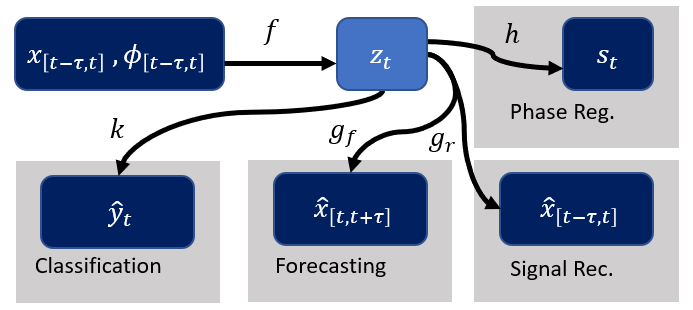

# PhysSignals-InterpretableInference
We introduce a methodology for improving inference on periodic signals by incorporating phase-based interpretability and other inference tasks (i.e classification, prediction) into a multi-task framework applied to a generative model.
The paper can be found in https://www.mdpi.com/2078-2489/13/7/326

# Datasets
Both datasets that Are used in this paper are publicly available. please refer to the paper for more information

# Usage

In the notebook provided, we provided the code to properly run the experiments mentioned in the paper. The models for IMU and ECG differs by some number of neurons which can be changed in the model section of the notebook. 
